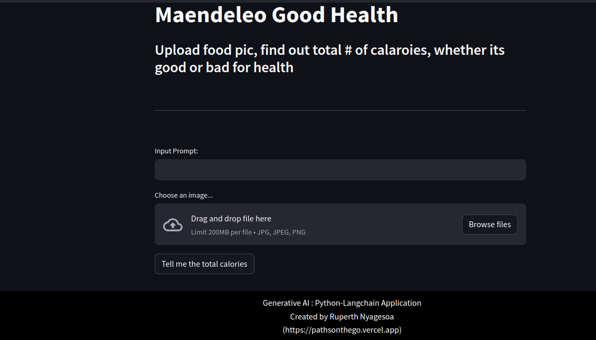

# Read It Before use this project
# Maendeleo Good Health

Maendeleo Good Health is an AI-powered nutritionist tool that revolutionizes the way we track and manage our food intake. By leveraging cutting-edge technologies such as Google GenerativeAI, Langchain, and PyPDF2, the app provides users with a comprehensive analysis of their dietary habits.

## Features

- **Image Analysis**: Upload images of your meals to get a detailed breakdown of the food items and their calorie content.
- **Calorie Calculation**: Automatically calculate the total calorie intake based on the analyzed food items.
- **Detailed Reports**: Receive detailed reports on each food item, including calorie count, macronutrient breakdown, and recommended serving size.
- **Personalized Recommendations**: Get personalized dietary recommendations based on your health goals and dietary restrictions.

## How It Works

1. **Image Upload**: Users can upload images of their meals through the app.
2. **AI Analysis**: The app uses Google GenerativeAI and other advanced technologies to analyze the images and identify food items.
3. **Calorie Calculation**: Based on the identified food items, the app calculates the total calorie intake.
4. **Detailed Reports**: Users receive detailed reports on each food item, helping them make informed decisions about their diet.

## Technologies Used

- **Streamlit**: The app's frontend is built using Streamlit, a popular Python library for building web applications.
- **Google GenerativeAI**: GenerativeAI is used for image analysis and food item recognition.
- **Python-dotenv**: Used for managing environment variables.
- **Langchain**: Langchain is used for natural language processing tasks.
- **PyPDF2**: PyPDF2 is used for working with PDF files.
- **Chromadb**: Chromadb is used for database management.
- **Pdf2image**: Pdf2image is used for converting PDF files to images.
- **Faiss-cpu**: Faiss-cpu is used for similarity search and clustering in high-dimensional spaces.
- **Langchain_google_genai**: Langchain_google_genai is a model used for language understanding tasks.

## Installation

1. Clone the repository:

   ```bash
   git clone https://github.com/ruperthnyagesoa/Maendeleo-Good-Health.git
   ```

2. Install the required dependencies:

   ```bash
   pip install -r requirements.txt
   ```

3. Set up your environment variables in a `.env` file:

   ```plaintext
   GOOGLE_API_KEY=your_google_api_key
   ```

4. Run the Streamlit app:

   ```bash
   streamlit run app.py
    ```
  ## UI 

